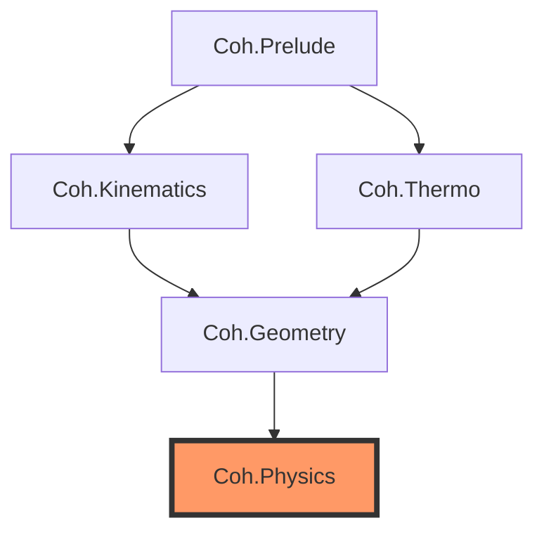

# Coh Lean Formalization

[](https://github.com/your-username/coh-lean/actions)
[](https://leanprover.github.io/)

> **Mechanizing the $C^4$ Inevitability Pipeline**

This repository provides a formal Lean 4 scaffold for the **Coh framework's** safety kernel. It mechanizes the "extermination ladder"—a series of thermodynamic and kinematic filters that prove the necessity of a spinorial Dirac carrier for certain classes of autonomous control systems.

## 🏛️ Architecture

The formalization is structured as a sequential ladder of proof obligations:



### Modules
1.  **`Coh.Prelude`**: Core definitions for metrics, spacetime indices, and the abstract `CliffordModule`.
2.  **`Coh.Kinematics`**: Formalizes **Clifford Necessity (T3)**. Proves that "oplax sound" symbols must satisfy the Clifford anticommutation relations.
3.  **`Coh.Thermo`**: Formalizes **Metabolic Minimality (T5)**. Tracks tracking costs and lifespan bounds.
4.  **`Coh.Geometry`**: Formalizes **Complexification (T6)**. Forces a complex structure via bounded persistence.
5.  **`Coh.Physics`**: The **Capstone Theorem**. Proves that the minimal lawful carrier surviving all filters is equivalent to the $C^4$ Dirac spinor.

## 🚀 Getting Started

### Prerequisites
- [Lean 4](https://leanprover.github.io/lean4/doc/setup.html) (stable)
- [Lake](https://github.com/leanprover/lake) (Lean's build system)
- [Mathlib4](https://github.com/leanprover-community/mathlib4) (handled by Lake)

### Build
To fetch dependencies and compile the scaffold:
```bash
lake update
lake build
```

### Nix Support
If you use Nix with flakes enabled, you can enter a pre-configured environment:
```bash
nix develop
```

## ⚖️ Status: Core Skeleton
This repository is a **formal scaffold**.
-   **Definitions**: Most core structures are formally defined using Mathlib.
-   **Theorems**: High-level theorem statements are present.
-   **Proofs**: Deep proof obligations are currently `admit`ted or represented as `axiom`s, providing a disciplined roadmap for full mechanization.

## 📝 License
Built with ❤️ by the Coh Project Contributors. Released under the [MIT License](LICENSE).
