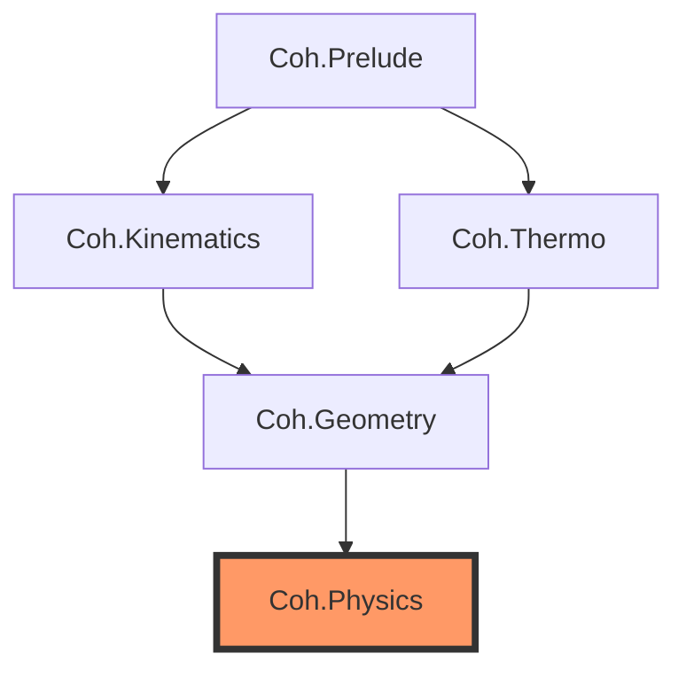

# Coh Lean Formalization

Build Status " Work in progress " 

[](https://github.com/your-username/coh-lean/actions)
[](https://leanprover.github.io/)

> **Mechanizing the $C^4$ Inevitability Pipeline**

This repository provides a formal Lean 4 scaffold for the **Coh framework's** safety kernel. It mechanizes the "extermination ladder"—a series of thermodynamic and kinematic filters that prove the necessity of a spinorial Dirac carrier for certain classes of autonomous control systems.

## 🏛️ Architecture

The formalization is structured as a sequential ladder of proof obligations:



### Modules

#### Core Foundation (`Coh.Core.*`)
- **`Coh.Core.Minimality`** (Phase 0.5d): Metabolic cost and thermodynamic dominance foundations. Defines cost functions, budget evolution, and lifespan bounds from module rank.
- **`Coh.Core.Complexification`** (Phase 0.5e): Complex-like structure (J operator with J² = -I) and persistence-to-complexification bridge. Establishes that 1D systems cannot support nontrivial periodic orbits, while 2D rotation is inherently complex-like.

#### Theorem Stacks
1.  **`Coh.Prelude`**: Core definitions for metrics, spacetime indices, and the abstract `CliffordModule`.
2.  **`Coh.Kinematics`** (T3): Formalizes **Clifford Necessity**. Proves that "oplax sound" symbols must satisfy the Clifford anticommutation relations.
3.  **`Coh.Thermo`** (T5): Formalizes **Metabolic Minimality**. Tracks tracking costs and lifespan bounds; irreducible minimal carriers are thermodynamically dominant over redundant extensions.
4.  **`Coh.Geometry`** (T6): Formalizes **Complexification**. Forces a complex structure via bounded persistence; shows that commutation with Clifford generators is preserved.
5.  **`Coh.Physics`**: The **Capstone Theorem**. Proves that the minimal lawful carrier surviving all filters is equivalent to the $C^4$ Dirac spinor.

## 🚀 Getting Started

### Prerequisites
- [Lean 4](https://leanprover.github.io/lean4/doc/setup.html) (stable)
- [Lake](https://github.com/leanprover/lake) (Lean's build system)
- [Mathlib4](https://github.com/leanprover-community/mathlib4) (handled by Lake)

### Build
To fetch dependencies and compile the scaffold:
```bash
lake update
lake build
```

### Nix Support
If you use Nix with flakes enabled, you can enter a pre-configured environment:
```bash
nix develop
```

## ⚖️ Status: Work in Progress - Build Blocked

### Current State (as of 2026-04-07)
- 🔴 **BUILD BLOCKED** — Missing Mathlib.Algebra.CliffordAlgebra.Basic import (Mathlib version mismatch)
- The codebase contains a structural scaffold for the Dirac Inevitability proof with several proved theorems and some placeholder/schema declarations
- Build was successful prior to Phase 4–7 work; current build fails due to dependency issue

### ✅ What Is Verified (Proved in Code)
- **T3 (Kinematics)**: Proved forward direction (Clifford → oplax soundness), coercive visibility contradiction
- **T5 (Thermodynamics)**: Proved rank ordering, cost comparison, lifespan bounds
- **T6 (Geometry)**: Proved 1D periodicity barrier, 2D rotation is complex-like
- **T7 (Visibility)**: Proved spectral gap via witness-based approach
- **T9 (Gauge)**: Proved commutation implies gauge invariance theorem

### 📋 Remaining Work (Proof Obligations)
- **T10 (Dirac Dynamics)**: String schemas only — uniqueness not proved
- **Bridge to Dirac spinor**: Schema composition, needs full proof
- **Fix Mathlib import**: Resolve dependency issue to restore build
This repository remains a **formal scaffold** for Phases 1-3:
-   **Definitions**: Core structures are formally defined using Mathlib.
-   **Theorems**: High-level theorem statements and bridges are present.
-   **Proofs**: Deep analytic and representation-theoretic proof obligations remain (`sorry` placeholders):
    - **T3 Bridge**: `AllMismatchWitnessesVisible` (Kinematics analytic visibility)
    - **T5 Bridge**: `FaithfulIrreducibleBridge` (Thermodynamic representation theory)
    - **T6 Bridges**: `PersistenceForcesComplexLike` + `ComplexLikeCommutesBridge` (Geometry)
    - **Capstone**: `Dirac_Inevitable_Schema` (Physics integration)

## 📝 License
Copyright © 2026 Noetican Labs (Michael Ellington). All Rights Reserved.
