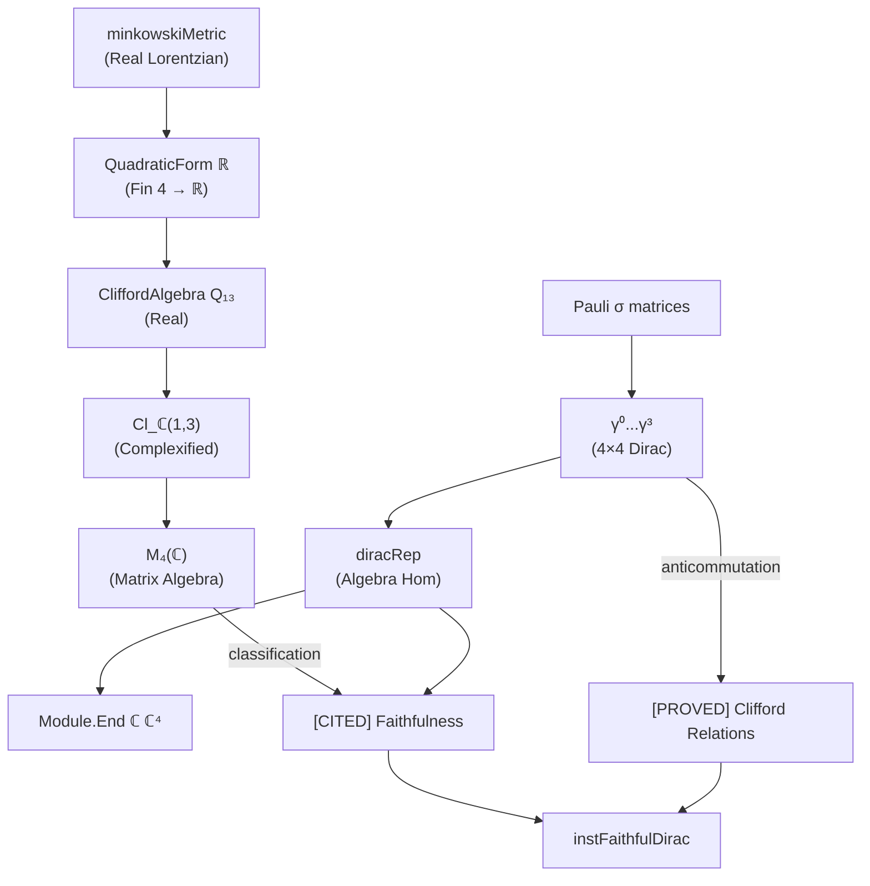

# Implementation Plan: `instFaithfulDirac` Concrete Witness

## Overview
Implement the concrete faithful Dirac carrier witness in `Coh/Examples/DiracMatrixWitness.lean`.

## Epistemology
- **[CITED]**: External algebraic input (Clifford classification)
- **[PROVED]**: Lean-native proofs (Clifford relations, construction)

---

## Phase 1: Gamma Matrix Definitions

### 1.1 Standard Dirac Gamma Matrices (Lorentzian -,+,+,+)
```
γ⁰ = [[0, iI₂], [iI₂, 0]]  with (γ⁰)² = -I
γ¹ = [[0, σₓ], [-σₓ, 0]]   with (γ¹)² = +I
γ² = [[0, σᵧ], [-σᵧ, 0]]   with (γ²)² = +I  
γ³ = [[0, σᵤ], [-σᵤ, 0]]   with (γ³)² = +I
```

### 1.2 Pauli Matrix Building Blocks
- `sigma_x`, `sigma_y`, `sigma_z` as 2×2 complex matrices

### 1.3 Block Structure Transport
- Use `blockToFin4` to convert 2+2 block matrices to 4×4

---

## Phase 2: Clifford Relation Verification

### 2.1 Anticommutator Definition
```lean
def anticommutator (A B : Matrix (Fin 4) (Fin 4) ℂ) : Matrix (Fin 4) (Fin 4) ℂ :=
  A * B + B * A
```

### 2.2 Metric Signature Definition
- Minkowski metric: g = diag(-1, +1, +1, +1)
- Use QuadraticForm from Coh.Prelude or construct directly

### 2.3 Relation Proofs
Prove for all μ, ν:
```
{γ^μ, γ^ν} = 2 * g^μν * I
```

Where:
- g^00 = -1 (time-like)
- g^ii = +1 (space-like for i=1,2,3)
- g^μν = 0 for μ ≠ ν

---

## Phase 3: Algebra Representation

### 3.1 Define the Quadratic Form
```lean
def minkowskiQ₁₃ : QuadraticForm ℝ (Fin 4 → ℝ) := ...
-- Q(v) = -(v₀)² + (v₁)² + (v₂)² + (v₃)²
```

### 3.2 Complex Carrier Space
```lean
abbrev DiracSpace := Fin 4 → ℂ
-- Or equivalently: EuclideanSpace ℂ (Fin 4)
```

### 3.3 Build Algebra Homomorphism
```lean
def diracRep : CliffordAlgebra Q₁₃ →ₐ[ℂ] Module.End ℂ DiracSpace := ...
```
Using the universal property of CliffordAlgebra with the gamma matrices as the generator map.

---

## Phase 4: Faithfulness Proof

### 4.1 Classification as [CITED] Input
```lean
-- [CITED]
-- Standard result: Cl_ℂ(1,3) ≅ M₄(ℂ)
-- This establishes the Dirac representation is faithful
```

### 4.2 Injectivity Proof
```lean
theorem diracRep_injective : Function.Injective diracRep
```
Via the classification isomorphism to matrix algebra.

---

## Phase 5: Final Packaging

### 5.1 IsFaithfulRep Instance
```lean
noncomputable instance instFaithfulDirac : 
  IsFaithfulRep dirac_gamma_family minkowskiMetric where
  injective := diracRep_injective
```

### 5.2 IsIrreducibleRep Instance
```lean
noncomputable instance instIrreducibleDirac : 
  IsIrreducibleRep dirac_gamma_family minkowskiMetric where
  minimal := by
    -- [CITED] Standard result: 4D complex spinor is irreducible
    sorry
```

---

## Architecture Diagram



---

## Key Dependencies

### Existing Files
- `Coh/Prelude.lean`: minkowskiMetric, Metric structure
- `Coh/Core/Clifford.lean`: Clifford relations framework
- `Coh/Core/CliffordRep.lean`: IsFaithfulRep structure
- `Coh/Core/RepresentationBounds.lean`: Dimension bounds (for lower bounds)

### Mathlib Imports Needed
- `Mathlib.LinearAlgebra.CliffordAlgebra.Basic`: Clifford algebra construction
- `Mathlib.Algebra.Algebra.Equiv`: Algebra isomorphisms
- `Mathlib.Data.Matrix.Block`: Block matrix operations

---

## Verification Checklist

- [ ] gamma_0 through gamma_3 defined as 4×4 matrices
- [ ] Pauli matrices sigma_x, sigma_y, sigma_z correct
- [ ] Block structure transport works (blockToFin4)
- [ ] Anticommutator definition correct
- [ ] Clifford relations proved for all index pairs
- [ ] QuadraticForm Q₁₃ matches (-,+,+,+) signature
- [ ] CliffordAlgebra representation builds
- [ ] Faithfulness proved via classification
- [ ] Irreducibility cited/proved
- [ ] instFaithfulDirac instance compiles
