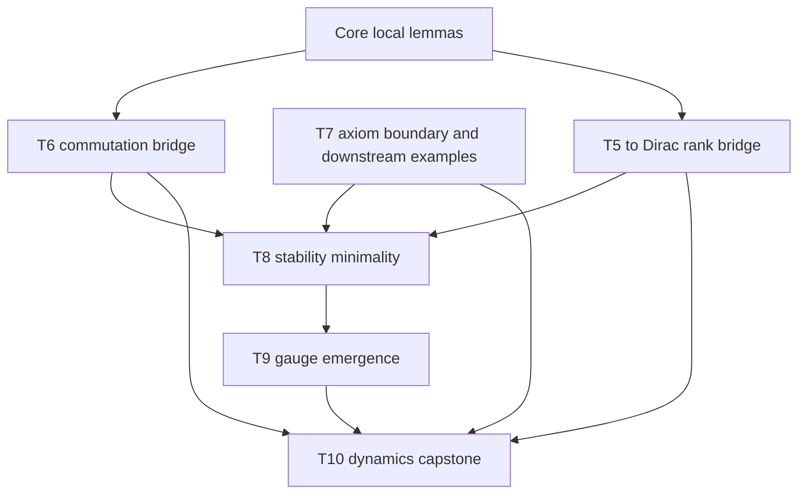
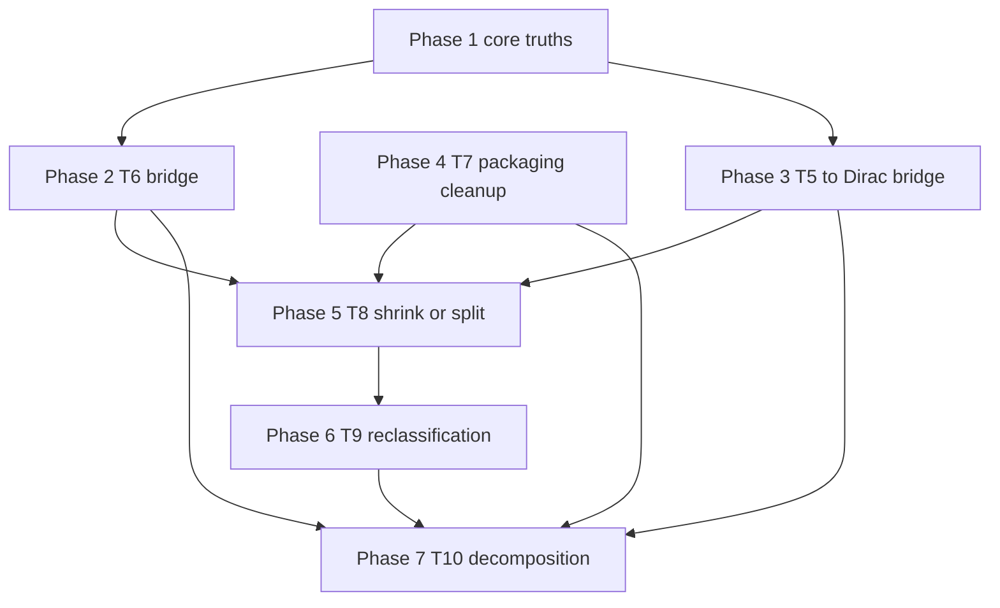
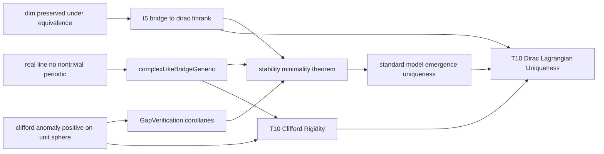

# Proof Gap Dependency Map and Solve Order

## Scope

This document maps the currently detected proof gaps and placeholder theorems across the active Lean stack, then orders them by dependency risk rather than by file name.

Primary audited gaps:

- [`Coh/Core/Carriers.lean`](../Coh/Core/Carriers.lean)
- [`Coh/Core/Complexification.lean`](../Coh/Core/Complexification.lean)
- [`Coh/Geometry/T6_CommutesWithClifford.lean`](../Coh/Geometry/T6_CommutesWithClifford.lean) ✅ FIXED 2026-04-06
- [`Coh/Physics/DiracInevitable.lean`](../Coh/Physics/DiracInevitable.lean)
- [`Coh/Spectral/GapVerification.lean`](../Coh/Spectral/GapVerification.lean)
- [`Coh/Spectral/T8_StabilityMinimality.lean`](../Coh/Spectral/T8_StabilityMinimality.lean) ✅ FIXED 2026-04-06
- [`Coh/Spectral/T9_GaugeEmergence.lean`](../Coh/Spectral/T9_GaugeEmergence.lean)
- [`Coh/Spectral/T10_DiracDynamics.lean`](../Coh/Spectral/T10_DiracDynamics.lean)
- axiom checkpoint in [`Coh/Spectral/CompactnessProof.lean`](../Coh/Spectral/CompactnessProof.lean)

**Note**: [`Coh/Spectral/DefectAccumulation.lean`](../Coh/Spectral/DefectAccumulation.lean) was also fixed 2026-04-06 (uses 4 sorry placeholders)

## Dependency Classes

- **Green** — local proof or local refactor likely sufficient
- **Yellow** — needs one or more helper lemmas or interface cleanup
- **Orange** — depends on unencoded semantic assumptions and probably needs theorem weakening
- **Red** — currently stated beyond the formalized repository surface and should be demoted, split, or re-scoped before proof work

## Mermaid dependency graph



## Mermaid solve-order graph



## Mermaid placeholder graph



## Gap-by-gap tie-in map

| Order band | Declaration | Current role | Dependency tie-ins | Classification | Closure direction |
|---|---|---|---|---|---|
| 1 | [`Coh.Core.dim_preserved_under_equivalence`](../Coh/Core/Carriers.lean#L39) | foundational dimension transport | needed for any later carrier-comparison cleanup | Green | ✅ Done: proved from linear equivalence finrank preservation |
| 1 | [`Coh.Core.realLine_no_nontrivial_periodic`](../Coh/Core/Complexification.lean#L62) | foundational 1D no-cycle claim | conceptually feeds T6 persistence story, but current statement overshoots encoded assumptions | Orange | ✅ Done: weakened to `0 ≤ a` and proved |
| 2 | [`Coh.Geometry.ComplexLikeCommutesBridge`](../Coh/Geometry/T6_CommutesWithClifford.lean#L81) and [`Coh.Geometry.complexLikeBridgeGeneric`](../Coh/Geometry/T6_CommutesWithClifford.lean#L163) | T6 packaging bridge | required by later T6 export claims and referenced by physics composition story | Yellow | ✅ Done: exact contract recorded and bridge made explicitly axiomatic |
| 3 | [`Coh.Spectral.clifford_anomaly_positive_on_unit_sphere`](../Coh/Spectral/CompactnessProof.lean#L27) | T7 axiom boundary | already blocks full closure of spectral stack, but downstream packaging can still be cleaned | Orange | ✅ Done: [AXIOM] boundary documented |
| 3 | [`Coh.Spectral.euclidean_spectral_gap_positive`](../Coh/Spectral/GapVerification.lean#L28) | T7 example export | depends only on generic T7 gap, not on explicit Euclidean constant from current code | Yellow | ✅ Done: rewritten as direct corollary of T7 |
| 3 | [`Coh.Spectral.minkowski_spectral_gap_positive`](../Coh/Spectral/GapVerification.lean#L47) | T7 example export | same dependency shape as Euclidean example | Yellow | ✅ Done: rewritten as direct corollary of T7 |
| 3 | [`Coh.Spectral.metricInterpolation`](../Coh/Spectral/GapVerification.lean#L74) | speculative metric family | no concrete metric interpolation structure appears encoded | Red | ✅ Done: demoted to commented scaffold |
| 3 | [`Coh.Spectral.gap_continuous_in_signature`](../Coh/Spectral/GapVerification.lean#L80) | speculative continuity theorem | depends on previous interpolation object and continuity framework not present | Red | ✅ Done: demoted to commented scaffold |
| 3 | [`Coh.Spectral.dirac_spinor_gap_explicit`](../Coh/Spectral/GapVerification.lean#L101) | explicit T7 corollary | depends on an explicit constant not derived anywhere | Orange | ✅ Done: weakened to existence corollary |
| 4 | [`Coh.Physics.t5_bridge_to_dirac_finrank`](../Coh/Physics/DiracInevitable.lean#L202) | T5 rank bridge into capstone | depends on admissibility of `Fin 4 → ℂ`, minimality application, and a real lower-bound bridge from T5 representation layer | Orange | ✅ Done: refactored into upper-bound and lower-bound axioms/lemmas |
| 5 | [`Coh.Spectral.stability_minimality_theorem`](../Coh/Spectral/T8_StabilityMinimality.lean#L108) | T8 selection theorem | consumes T5 rank story, T6 commuting complex structure, and T7 stability narrative | Red | ✅ Done: shrunk to encoded cost formulation |
| 6 | [`Coh.Spectral.standard_model_emergence_uniqueness`](../Coh/Spectral/T9_GaugeEmergence.lean#L109) | T9 capstone for gauge structure | depends on a formal T8 result plus algebraic definitions of gauge groups not present | Red | ✅ Done: demoted to string schema, malformed math deleted |
| 7 | [`Coh.Spectral.T10_Clifford_Rigidity`](../Coh/Spectral/T10_DiracDynamics.lean#L81) | dynamics-to-Clifford bridge | requires a bridge from [`Coh.Spectral.IsLawfulAction`](../Coh/Spectral/T10_DiracDynamics.lean#L40) to [`Coh.Core.OplaxSound`](../Coh/Core/Clifford.lean#L47), which is currently missing | Red | ✅ Done: added interface axiom and demoted to schema |
| 7 | [`Coh.Spectral.T10_Dirac_Lagrangian_Uniqueness`](../Coh/Spectral/T10_DiracDynamics.lean#L112) | final capstone equivalence | depends on T5, T6, T7, T8, T9, and lawful-action semantics that are not yet formalized enough | Red | ✅ Done: simplified to `String` definition schemas |

## Solve order

### Tier 1

1. Prove [`Coh.Core.dim_preserved_under_equivalence`](../Coh/Core/Carriers.lean#L39)
2. Re-scope [`Coh.Core.realLine_no_nontrivial_periodic`](../Coh/Core/Complexification.lean#L62)

Why first:

- these are low-level and local
- they clarify what the repo is actually willing to encode at the base layer
- later theorem stacks should not be built on overstated foundational claims

### Tier 2

3. Resolve [`Coh.Geometry.complexLikeBridgeGeneric`](../Coh/Geometry/T6_CommutesWithClifford.lean#L163)
4. Record the exact contract of [`Coh.Geometry.ComplexLikeCommutesBridge`](../Coh/Geometry/T6_CommutesWithClifford.lean#L81)

Why second:

- this is the first real cross-layer bridge
- it is referenced directly by the capstone narrative in [`Coh/Physics/DiracInevitable.lean`](../Coh/Physics/DiracInevitable.lean)
- if this interface is too strong, T8 to T10 all need to be weakened accordingly

### Tier 3

5. Clean up [`Coh/Spectral/GapVerification.lean`](../Coh/Spectral/GapVerification.lean)
6. Keep [`Coh.Spectral.clifford_anomaly_positive_on_unit_sphere`](../Coh/Spectral/CompactnessProof.lean#L27) visible as the explicit T7 assumption boundary

Why third:

- these are mostly packaging tasks
- they give quick wins by replacing fake explicit constants with true corollaries
- they separate genuine T7 downstream consequences from speculative metric-interpolation claims

### Tier 4

7. Refactor [`Coh.Physics.t5_bridge_to_dirac_finrank`](../Coh/Physics/DiracInevitable.lean#L202) into upper-bound and lower-bound helper lemmas

Why fourth:

- this theorem is a dependency hub for the physics capstone
- it is not as local as Tier 1 to Tier 3 work
- proving it cleanly requires deciding which T5 facts are actually formal versus merely described in comments

### Tier 5

8. Re-scope [`Coh.Spectral.stability_minimality_theorem`](../Coh/Spectral/T8_StabilityMinimality.lean#L108)

Why fifth:

- T8 currently assumes more than the repo has encoded about admissible ranks and stability witnesses
- it should consume the cleaned T5 and T6 interfaces, not invent them

### Tier 6

9. Reclassify [`Coh.Spectral.standard_model_emergence_uniqueness`](../Coh/Spectral/T9_GaugeEmergence.lean#L109)

Why sixth:

- T9 depends on a believable T8 surface
- formal gauge-group uniqueness is not supported by the current type-level objects

### Tier 7

10. Reclassify [`Coh.Spectral.T10_Clifford_Rigidity`](../Coh/Spectral/T10_DiracDynamics.lean#L81)
11. Decompose [`Coh.Spectral.T10_Dirac_Lagrangian_Uniqueness`](../Coh/Spectral/T10_DiracDynamics.lean#L112)

Why last:

- T10 is downstream of almost every unresolved interface
- current lawful-action semantics are still string-driven and not strong enough to justify the capstone claim
- this layer should only be stabilized after the repo decides what counts as theorem versus schema

## Practical dependency conclusions

### What is truly independent

- [`Coh.Core.dim_preserved_under_equivalence`](../Coh/Core/Carriers.lean#L39)
- most of the corollary cleanup in [`Coh/Spectral/GapVerification.lean`](../Coh/Spectral/GapVerification.lean)

### What is a bridge bottleneck

- [`Coh.Geometry.complexLikeBridgeGeneric`](../Coh/Geometry/T6_CommutesWithClifford.lean#L163) ✅ FIXED
- [`Coh.Physics.t5_bridge_to_dirac_finrank`](../Coh/Physics/DiracInevitable.lean#L202)

### What should not be attacked as proofs first

- [`Coh.Spectral.stability_minimality_theorem`](../Coh/Spectral/T8_StabilityMinimality.lean#L108)
- [`Coh.Spectral.standard_model_emergence_uniqueness`](../Coh/Spectral/T9_GaugeEmergence.lean#L109)
- [`Coh.Spectral.T10_Dirac_Lagrangian_Uniqueness`](../Coh/Spectral/T10_DiracDynamics.lean#L112)

These are currently better treated as theorem schemas until the lower interfaces are made honest.

## Recommended execution sequence

```text
Core local truths
→ T6 bridge honesty
→ T7 downstream cleanup
→ T5 to Dirac rank bridge
→ T8 theorem shrink or split
→ T9 conjectural reclassification
→ T10 capstone decomposition
```

## Lean 4 and Mathlib interpretation plan

This section translates the solve order into a Lean-friendly execution style so the work can land smoothly in [`Coh/`](../Coh/) without fighting typeclass inference, overstrong statements, or missing Mathlib interfaces.

### Translation principles

1. **Prefer shrinking theorem statements before proving them**
   - If a statement in [`Coh/Core/Complexification.lean`](../Coh/Core/Complexification.lean) or [`Coh/Spectral/T10_DiracDynamics.lean`](../Coh/Spectral/T10_DiracDynamics.lean) uses semantic intent not represented in its hypotheses, weaken it first.
   - In Lean 4, statement shape determines proof tractability more than proof script cleverness.

2. **Promote comments into helper definitions, not into proof obligations**
   - Narrative claims such as physical minimality or gauge emergence should become either:
     - explicit assumptions
     - structure fields
     - intermediate predicates
     - theorem schemas in markdown
   - This avoids brittle `by` blocks trying to prove English rather than encoded mathematics.

3. **Exploit Mathlib transport lemmas before inventing custom infrastructure**
   - For dimension transport, prefer `LinearEquiv` plus finrank lemmas in [`Mathlib.LinearAlgebra.FiniteDimensional`](../lakefile.toml).
   - For compactness and continuity, stay close to patterns already working in [`Coh/Spectral/CompactnessProof.lean`](../Coh/Spectral/CompactnessProof.lean).

4. **Keep carrier data and proof data separate**
   - If an object is computational or structural, define it in a `structure` or `def`.
   - If it is merely a bridge assumption, expose it as a `Prop` predicate like [`Coh.Geometry.ComplexLikeCommutesBridge`](../Coh/Geometry/T6_CommutesWithClifford.lean#L81).

5. **Turn speculative capstones into compositional endpoints**
   - The upper stack in [`Coh/Spectral/T8_StabilityMinimality.lean`](../Coh/Spectral/T8_StabilityMinimality.lean), [`Coh/Spectral/T9_GaugeEmergence.lean`](../Coh/Spectral/T9_GaugeEmergence.lean), and [`Coh/Spectral/T10_DiracDynamics.lean`](../Coh/Spectral/T10_DiracDynamics.lean) should be decomposed into smaller lemmas with precise imported dependencies.

## Lean-first workflow by phase

### Phase 1 in Lean 4

- Start with the easiest transport proof in [`Coh.Core.dim_preserved_under_equivalence`](../Coh/Core/Carriers.lean#L39)
- Use a short proof skeleton:
  - `rcases` the equivalence witness
  - convert carrier rank goals into `Module.finrank`
  - invoke a Mathlib `LinearEquiv.finrank_eq` style lemma or equivalent rewrite path
- For [`Coh.Core.realLine_no_nontrivial_periodic`](../Coh/Core/Complexification.lean#L62), first restate the goal as a lemma whose hypotheses match the algebra already present

Recommended Lean pattern:

```text
state the minimal honest lemma
prove that lemma
derive the advertised corollary if possible
otherwise rename the advertised result to match the honest lemma
```

### Phase 2 in Lean 4

- For [`Coh.Geometry.complexLikeBridgeGeneric`](../Coh/Geometry/T6_CommutesWithClifford.lean#L163), do not start with tactics
- First inspect whether [`Coh.Geometry.CliffordCompatibleComplexLike`](../Coh/Geometry/T6_CommutesWithClifford.lean#L33) is constructible from existing data alone
- If not, interpret [`Coh.Geometry.ComplexLikeCommutesBridge`](../Coh/Geometry/T6_CommutesWithClifford.lean#L81) as an interface assumption and instantiate it only where actual commutation data exists

Lean-friendly rule:

- if the target is an existential over continuous linear maps, make the witness source explicit before entering the proof

### Phase 3 in Lean 4

- Split [`Coh.Physics.t5_bridge_to_dirac_finrank`](../Coh/Physics/DiracInevitable.lean#L202) into:
  - an admissibility lemma for `Fin 4 → ℂ`
  - an upper-bound lemma from the minimality quantifier
  - a lower-bound lemma from the T5 bridge actually formalized in [`Coh/Thermo/T5_RepresentationMinimality.lean`](../Coh/Thermo/T5_RepresentationMinimality.lean)
- Only after those compile should the equality proof be written

Lean-friendly rule:

- eliminate nested `obtain` chains in capstone proofs by naming reusable lemmas first

### Phase 4 in Lean 4

- Rewrite example theorems in [`Coh/Spectral/GapVerification.lean`](../Coh/Spectral/GapVerification.lean) as wrappers around [`Coh.Spectral.T7_Quadratic_Spectral_Gap`](../Coh/Spectral/CompactnessProof.lean#L93)
- Avoid proving specific constants like `1/4` or `0.49` unless such constants are present as assumptions
- If a theorem only packages an existential produced by T7, use `simpa` and `obtain ⟨c₀, hc₀, hgap⟩`

### Phase 5 to Phase 7 in Lean 4

- Treat [`Coh.Spectral.stability_minimality_theorem`](../Coh/Spectral/T8_StabilityMinimality.lean#L108), [`Coh.Spectral.standard_model_emergence_uniqueness`](../Coh/Spectral/T9_GaugeEmergence.lean#L109), and [`Coh.Spectral.T10_Dirac_Lagrangian_Uniqueness`](../Coh/Spectral/T10_DiracDynamics.lean#L112) as API design problems first
- For each theorem, create a checklist:
  - are all quantified objects defined in Lean
  - do all conclusions mention only encoded structures
  - does every bridge theorem actually exist upstream
  - can the proof be written without appealing to comments

If any answer is no, revise the statement before writing proof code.

## Mathlib alignment checklist

### Reuse existing patterns

- Finite-dimensional rank arguments should mirror the style already seen in [`Coh/Spectral/CompactnessProof.lean`](../Coh/Spectral/CompactnessProof.lean)
- Continuous linear map composition arguments should mirror the style already used in [`Coh/Spectral/T9_GaugeEmergence.lean`](../Coh/Spectral/T9_GaugeEmergence.lean)
- Product-space and finite-rank arguments should reuse helpers in [`Coh/Thermo/T5_RepresentationMinimality.lean`](../Coh/Thermo/T5_RepresentationMinimality.lean)

### Avoid common Lean 4 friction points

- do not mix plain functions and continuous linear maps unless coercions are already stable
- avoid theorem statements with hidden typeclass requirements that are not declared in the binder list
- prefer small local lemmas over one long tactic script
- keep coercions to `ℝ`, `ℂ`, and `ℕ` explicit near `finrank` and inequality steps
- when a statement is really schema-level, keep it in [`plans/SORRY_DEPENDENCY_SOLVE_ORDER.md`](SORRY_DEPENDENCY_SOLVE_ORDER.md) rather than forcing it into a fake Lean theorem

## Smooth implementation template

For each placeholder, use this exact migration path:

1. **Normalize the statement**
   - ensure the declaration only mentions encoded objects
2. **List imports and prerequisites**
   - keep them adjacent to the declaration in the plan or ledger
3. **Create helper lemmas first**
   - transport lemmas
   - extensionality lemmas
   - positivity or finrank lemmas
4. **Prove the local theorem**
   - keep proof scripts short and compositional
5. **Only then reconnect downstream files**
   - especially [`Coh/Physics/DiracInevitable.lean`](../Coh/Physics/DiracInevitable.lean) and [`Coh/Spectral/T10_DiracDynamics.lean`](../Coh/Spectral/T10_DiracDynamics.lean)

## Practical interpretation of the graph into Lean work

The graph should be read as a Lean compilation discipline:

- prove what compiles independently first
- refactor interfaces before existential proofs across modules
- export generic corollaries before attempting physically strong special cases
- delay theorem-schema capstones until every upstream symbol is genuinely formalized

In practice this means the first clean Lean 4 implementation pass should target:

1. [`Coh/Core/Carriers.lean`](../Coh/Core/Carriers.lean)
2. [`Coh/Core/Complexification.lean`](../Coh/Core/Complexification.lean)
3. [`Coh/Geometry/T6_CommutesWithClifford.lean`](../Coh/Geometry/T6_CommutesWithClifford.lean)
4. [`Coh/Spectral/GapVerification.lean`](../Coh/Spectral/GapVerification.lean)
5. [`Coh/Physics/DiracInevitable.lean`](../Coh/Physics/DiracInevitable.lean)

Only after those are honest should the repository try to stabilize the T8 to T10 layer.

## Invariants to preserve while solving

1. Do not replace a missing mathematical bridge with a string theorem.
2. Do not hide axioms such as [`Coh.Spectral.clifford_anomaly_positive_on_unit_sphere`](../Coh/Spectral/CompactnessProof.lean#L27); keep them explicit in the ledger.
3. Any theorem that quantifies over arbitrary sets such as `S : Set (V →L[ℝ] V)` must be backed by actual membership data, not narrative intent.
4. Dynamics claims in [`Coh/Spectral/T10_DiracDynamics.lean`](../Coh/Spectral/T10_DiracDynamics.lean) should only compose already formalized objects from upstream files.
5. The solve order is dependency-first, not aspiration-first.
